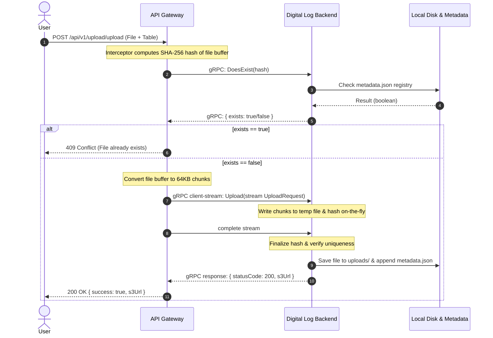

# File Deduplication & Upload POC

This Proof of Concept (POC) implements a secure, high-performance file upload system between an API Gateway and a Digital Log backend service using content-based deduplication, supporting large file uploads over gRPC.

---

## Architectural Highlights

### 1. Content-Based Unique Identifier (Deduplication Engine)
Instead of relying on unstable metadata like file names or timestamps (which can easily be altered), we implement a **Content-Hash Unique Identifier**:
* **SHA-256 Fingerprint**: For every uploaded file, we compute a `SHA-256` hash of its raw binary contents. This hash acts as the absolute unique identifier of the file.
* **Fast Interception Check**: A custom NestJS interceptor/decorator (`@FileInterceptAndCheckExists()`) on the Gateway calculates the file hash and queries the backend via gRPC (`DoesExist` call).
* **Conflict Prevention**: If the hash already exists in the backend's metadata registry, the Gateway terminates the request early and returns a `409 Conflict` error, saving network bandwidth and disk operations.

### 2. Large File Support (gRPC Client-Streaming & `@GrpcStreamCall`)
To prevent memory bloat and support large file sizes without exceeding gRPC's default payload limit (4MB), the file upload is processed using chunk-based streaming:
* **Chunking**: The Gateway splits the uploaded file into `64KB` chunks and streams them asynchronously.
* **Direct Stream Pipe (`@GrpcStreamCall`)**: The backend utilizes NestJS's low-level `@GrpcStreamCall()` decorator to read directly from the raw gRPC readable stream.
  > [!NOTE]
  > We explicitly use `@GrpcStreamCall()` instead of `@GrpcStreamMethod()` because of a known issue in NestJS's high-level gRPC microservice implementation, where the `complete` lifecycle event fails to propagate correctly to `@GrpcStreamMethod` when handling client-side streams (many requests, single response). Using `@GrpcStreamCall` provides direct access to Node's raw gRPC stream events (`data`, `end`, `error`), resolving this issue.
* **On-The-Fly Hashing**: Chunks are written to a temp file and updated in the cryptographic hash object on-the-fly, ensuring the entire file is never held in memory.

---

## Component Flow



---

## Running Locally

### 1. Start the Backend
Navigate to the backend directory and run start:
```bash
cd digitallog_and_notification_backend
npm run start
```
* gRPC runs on `localhost:5001`.

### 2. Start the Gateway
In a new terminal window, navigate to the gateway directory and run start:
```bash
cd gateway
npm run start
```
* API Gateway runs on `http://localhost:3000`.

---

## Running with Docker Compose

You can launch both services and set up a shared workspace volume via Docker Compose:
```bash
docker compose up -d --build
```

---

## Testing Uploads
Use the following `curl` command to test uploads:
```bash
curl -X POST http://localhost:3000/api/v1/upload/upload \
  -F "file=@/path/to/your/file.ext" \
  -F "table=my_table"
```
Once uploaded, you will see the generated files and the metadata registry directly inside the local `./uploads` directory mapped to your host workspace.
